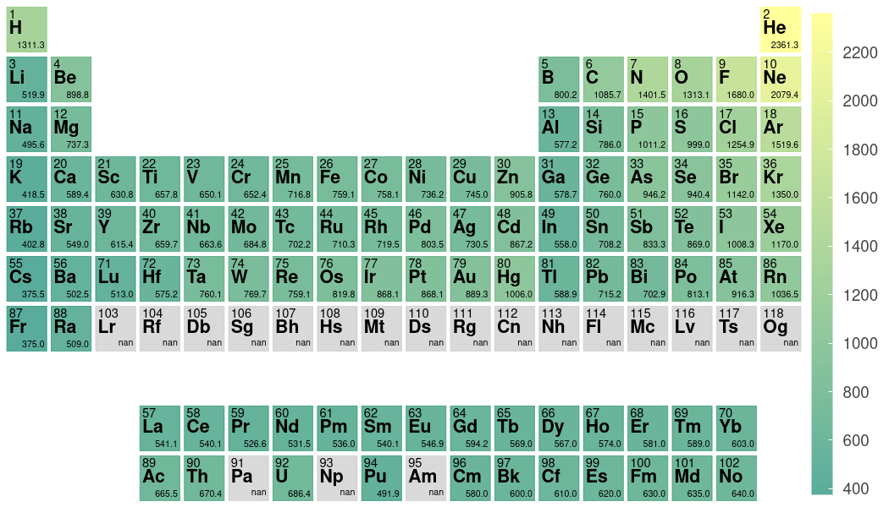

# Periodic Trend Plotter

Python script to plot periodic trends as a heat map over the periodic table of elements.

## Installation

```
pip install git+https://github.com/Andrew-S-Rosen/periodic_trends.git
```

## Usage

This Python code can be used to plot a heat map over an image of the periodic table of elements for easy and automated visualization of periodic trends.

A minimal example is as follows:

```python
from periodic_trends import plotter
import pandas as pd

df = pd.read_csv("ionization_energies.csv", names=["Element", "Ionization Energy"])
plotter(df, "Element", "Ionization Energy")
```


The `plotter()` function reads a pandas DataFrame containing periodic trend data. DataFrames can be read from a wide range of data formats, such as csv and xlsx. The `plotter()` takes three required arguments, the first being the DataFrame itself, the second is the name of the column containing the atom symbols of your elements, and the last being the name of column of the values you wish to plot.

After the `periodic_trends.py` script is run, it will show the plot in your web browser. To save the image, simply click the save icon that appears in the web browser figure.

There are numerous optional arguments, which can be used to modify the appearance of the figure. A couple of examples using various optional keyword arguments are as follows:

```python
from periodic_trends import plotter
import pandas as pd

df = pd.read_csv("ionization_energies.csv", names=["Element", "Ionization Energy"])
plotter(df, "Element", "Ionization Energy", log_scale=True)
```


```python
from periodic_trends import plotter
import pandas as pd
from matplotlib import cm

df = pd.read_csv("ionization_energies.csv", names=["Element", "Ionization Energy"])
plotter(
    df,
    "Element",
    "Ionization Energy",
    cmap=cm.viridis,
    alpha=0.7,
    extended=False,
    periods_remove=[1],
)
```


```python
import pandas as pd
from periodic_trends import plotter
from matplotlib import cm

df = pd.read_csv("ionization_energies.csv", names=["Element", "Ionization Energy"])
test = plotter(df, "Element", "Ionization Energy", print_data=True, cmap=cm.summer)
```



## Troubleshooting


If the plot doesn't show up the first time (sometimes happens in Jupyter Notebooks), try calling the following first:

```python
from bokeh.io import output_notebook

output_notebook()
```
