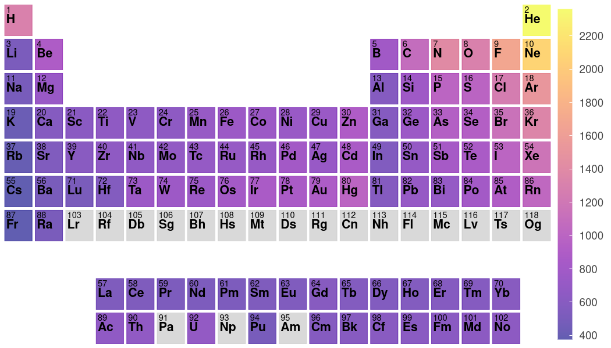
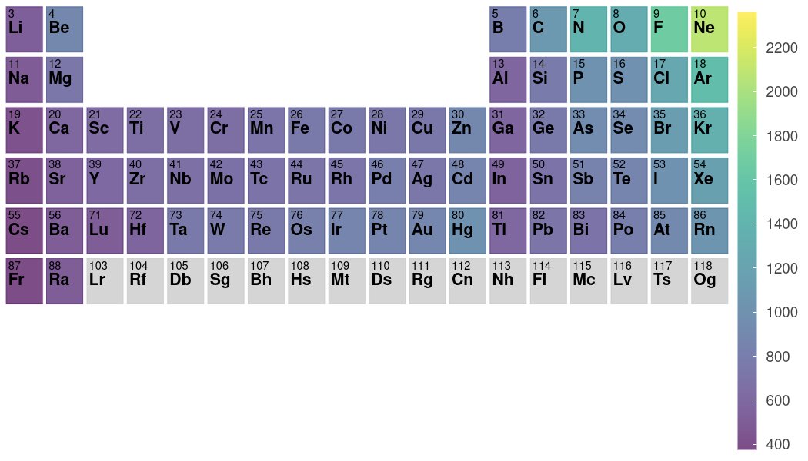

# Periodic Trend Plotter

Python script to plot periodic trends as a heat map over the periodic table of elements.

## Usage

This Python script (`periodic_trends.py`) can be used to plot a heat map over an image of the periodic table of elements for easy and automated visualization of periodic trends.

A minimal example is as follows:

```python
from periodic_trends import plotter
plotter("ionization_energies.csv")
```



The only required argument to `plotter()` is a single positional argument for the full filepath/name (with extension) of the data file containing your periodic trend data. The data file must be in a comma-separated value (`.csv`) format with the first entry in each row being the atom symbol and the second entry being the value you wish to plot. An example `.csv` file is included in this repository for testing purposes under the name `ionization_energies.csv`. After the `periodic_trends.py` script is run, it will show the plot in your web browser. To save the image, simply click the save icon that appears in the web browser figure.

There are numerous optional arguments, which can be used to modify the appearance of the figure. The full argument list is below:
https://github.com/Andrew-S-Rosen/periodic_trends/blob/1f374d8f8a160be0e361acc965282b63341c53e4/periodic_trends.py#L28-L101

A couple of examples using various optional keyword arguments are as follows:

```python
from periodic_trends import plotter
plotter("ionization_energies.csv", log_scale=True)
```


```python
from periodic_trends import plotter
plotter("ionization_energies.csv", cmap="viridis", alpha=0.7, extended=False, periods_remove=[1])
```



## Dependencies

The script requires the following dependencies:

- [Bokeh](http://bokeh.pydata.org/en/latest/)
- [pandas](http://pandas.pydata.org/)
- [matplotlib](http://matplotlib.org/)

These packages can be installed using [pip](https://pip.pypa.io/en/stable/) via `pip install -r requirements.txt` in the `periodic_trends` base directory.
